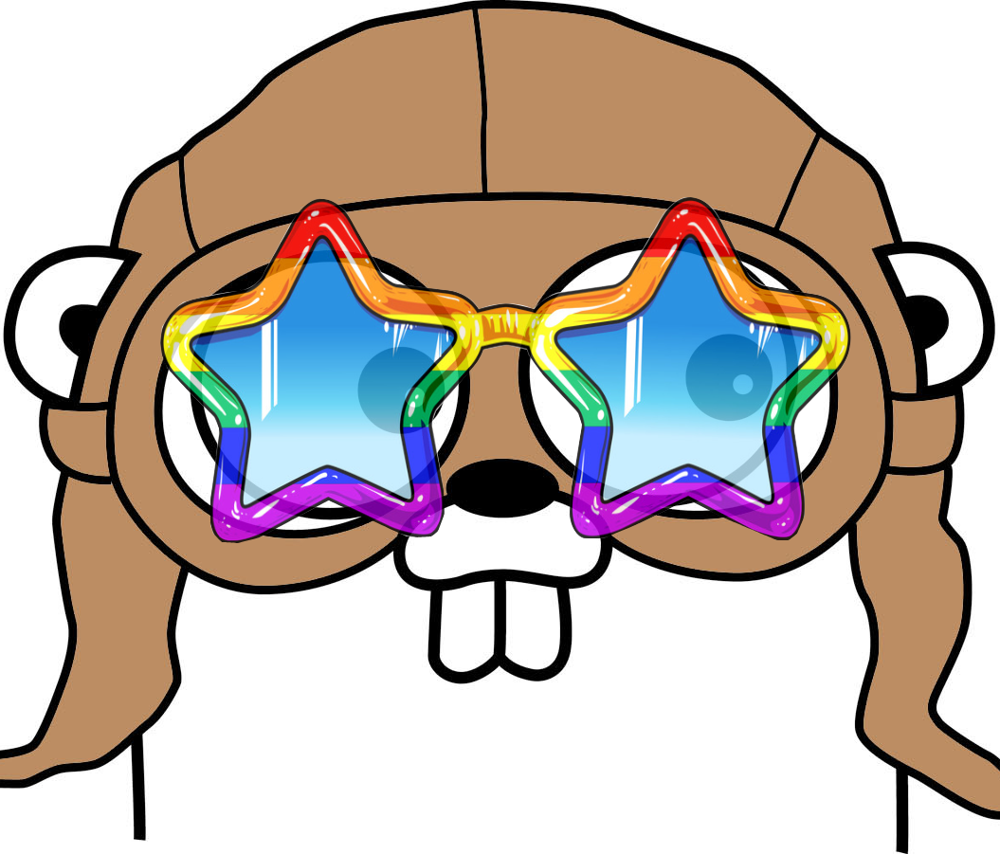

# meet discogopher
a multi purpose discord bot written in Golang

# Features - Work in progress

| Command   | Description                         |
|-----------|-------------------------------------|
| roll      | Opens a menu to chose dice that can be rolled. Sends roll result as message.| 
| event     | Creates a server wide event that's customizable.|
| poll      | Creates a poll that users can interact with by voting via emojis. |